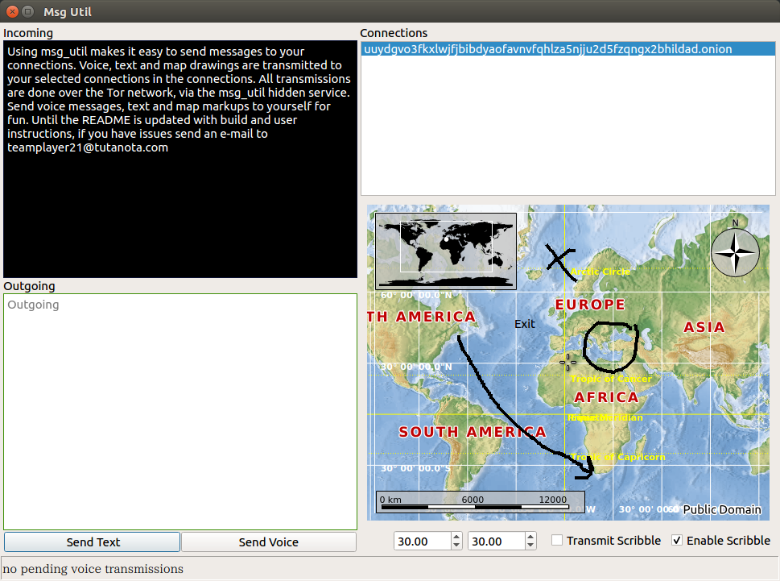
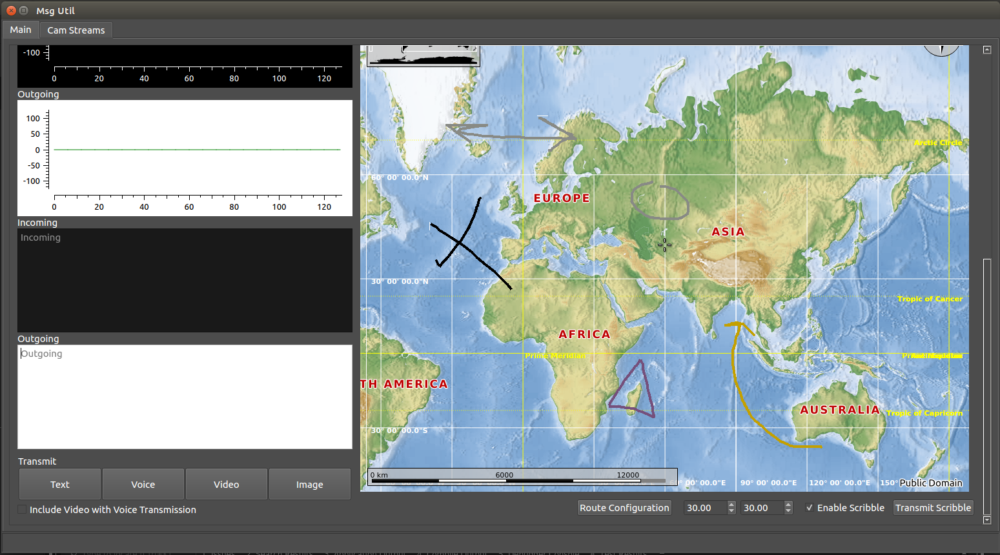
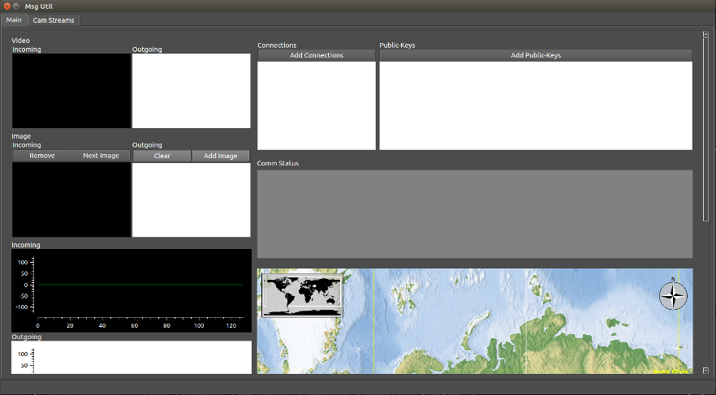

# Msg Util
Free opensource voice, and text messaging utility for the Tor anonymity network. To learn about the Tor network go here https://www.torproject.org. This application includes a world map users can markup, and transmits their drawings the same as voice, text messages, graphics, and video. Using msg_util makes it easy to send a variety of messages to your connection on the Tor network. You only need to select an onion address in the connections list, and click the send button of your choice.

Msg_util uses push-to-talk functionality for voice messages. All data is transmitted over the Tor network via the msg_util hidden service. Using the Torrc_Util application (i.e., https://github.com/jim45002/torrc_util) users select message communications routes. For each transmitted voice, text, image, video, and map-markup, the Tor service will do layered encryption, and route the data through user selected network nodes. Before transmittng the message, additonal encryption can be performed on the data using user provided public-keys in the GUI's public-key selection list. 

Msg_util is another free optional tool for anonymous private communications during mission planning, or business excursions in remote parts of the world.    

This application was written for Debian Linux. 

<table>
<tr> 
<td>  </td>
</tr>
<tr> 
<td> <b>Object detection in camera video stream and map used for location tracking</b> </td>
</tr>
<tr> 
<td>  </td>
</tr>
<tr> 
<td><b>Incoming map-markup, voice and text message arriving through Tor network</b></td>
</tr>
<tr> 
<td>   </td>
</tr>
<tr> 
<td> <b>Main window tab showing another map-markup</b> </td>
</tr>
<tr> 
<td>   </td>
</tr>
<tr> 
<td> <b> Main window showing public-key and connections listbox </b></td>
</tr>
</table>

# Build Instructions
Upon request a release tarball can be sent to you with usage instructions. This source code was built using the cmake build tool. How to build and usage instructions will be added to this repository soon. If you would like to build and run the application and have questions contact the Bitmessage address BM-2cWzE6TNpMDuaA9ZcLubBfxderyTsnKQ8n with any questions or email hotmethods@protonmail.com. This is a new repository and Msg_util isn't in a release state yet so, please be patient.

