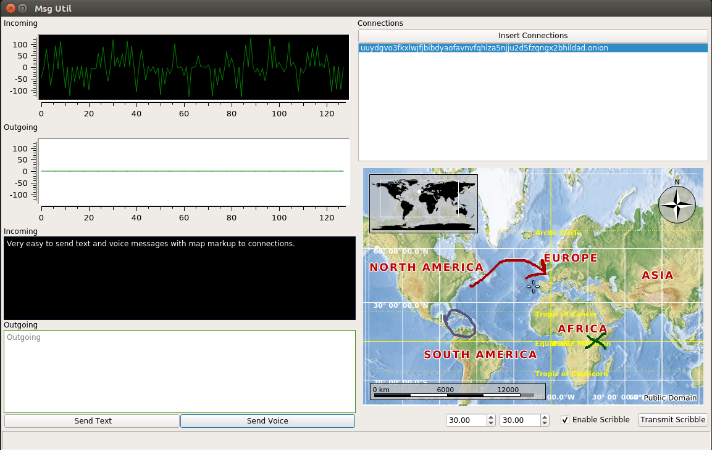

# Msg Util
Voice, and text messaging utility for the Tor network. To learn about the Tor network go here https://www.torproject.org. This application includes a world map users can markup, and transmits their drawings the same as voice and text messages. Using msg_util makes it easy to send voice, text, map drawings to anyone on the Tor network. You only need to select an onion address in the connections list and click the send button of your choice. Msg_util uses push-to-talk functionality for voice messages. All voice, text, and map markups are transmitted over the Tor network via the msg_util hidden service. This application was written for Linux and was only run on Ubuntu 16 LTS. 

<table>
<tr> 
<td>  </td>
</tr>
<tr> 
<td>   </td>
</tr>
<tr> 
<td>   </td>
</tr>
</table>

<table>
<tr> 
<td>  </td>
<td>  </td>
<td>  </td>
<td>  </td>
<td>  </td>
</tr>
<tr> 
<td> </td>
<td> </td>
<td> </td>
<td> </td>
<td> </td>
</tr>
</table>

# Build Instructions
This source code was built using the cmake build tool. How to build and usage instructions will be added to this repository soon. If you would like to build and run the application and have questions contact the Bitmessage address BM-2cWzE6TNpMDuaA9ZcLubBfxderyTsnKQ8n with any questions or email hotmethods@protonmail.com. This is a new repository so, please be patient.

